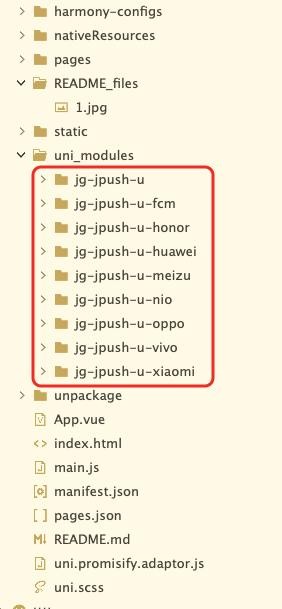

# jg-uniapp-demo

# 手动下载复制

想用哪个操作，复制到对应的插件文件夹到自己项目的uni_modules下就可以了。

# 插件下载
- [jg-jpush-u 主插件](https://ext.dcloud.net.cn/plugin?name=jg-jpush-u)
- [jg-jpush-u-fcm FCM推送](https://ext.dcloud.net.cn/plugin?name=jg-jpush-u-fcm)
- [jg-jpush-u-honor 荣耀推送](https://ext.dcloud.net.cn/plugin?name=jg-jpush-u-honor)
- [jg-jpush-u-huawei 华为推送](https://ext.dcloud.net.cn/plugin?name=jg-jpush-u-huawei)
- [jg-jpush-u-meizu 魅族推送](https://ext.dcloud.net.cn/plugin?name=jg-jpush-u-meizu)
- [jg-jpush-u-nio 蔚来推送](https://ext.dcloud.net.cn/plugin?name=jg-jpush-u-nio)
- [jg-jpush-u-oppo OPPO推送](https://ext.dcloud.net.cn/plugin?name=jg-jpush-u-oppo)
- [jg-jpush-u-vivo VIVO推送](https://ext.dcloud.net.cn/plugin?name=jg-jpush-u-vivo)
- [jg-jpush-u-xiaomi 小米推送](https://ext.dcloud.net.cn/plugin?name=jg-jpush-u-xiaomi)
- 

## 1. 极光推送平台配置

### 1.1 创建应用

1. 登录[极光推送控制台](https://www.jiguang.cn/)
2. 创建新应用或选择现有应用
3. 记录应用的AppKey

- [android 配置](./uni_modules/jg-jpush-u/Android_Integration_Guide.md)
- [鸿蒙 配置](./uni_modules/jg-jpush-u/readme_me.md)
- [ios 配置](./uni_modules/jg-jpush-u/iOS_Integration_Guide.md)
- 
- [android api](./uni_modules/jg-jpush-u/Android_API_Documentation.md)
- [鸿蒙 api](./uni_modules/jg-jpush-u/HarmonyOS_API_Documentation.md)
- [ios api](./uni_modules/jg-jpush-u/iOS_API_Documentation.md)
- 
- [三平台API对比](./uni_modules/jg-jpush-u/API_Comparison_Documentation.md)

## 2. 相关资源

- [极光推送官方文档](https://docs.jiguang.cn/jpush/)
- [uni-app官方文档](https://uniapp.dcloud.net.cn/)
- [Android开发文档](https://developer.android.com/) 